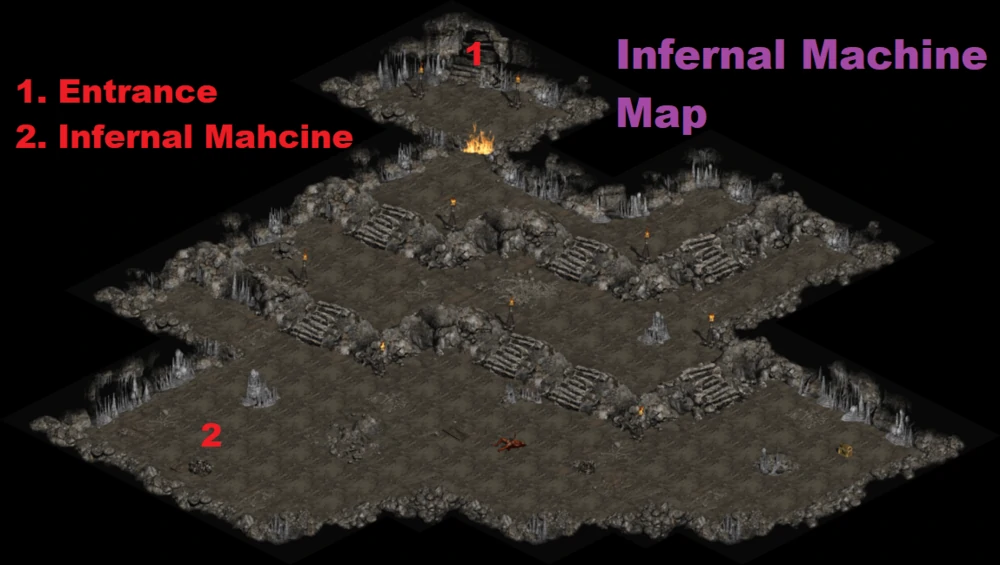

# 105 等超級任務

## 屠夫

地獄難度 A1  
救凱恩的紅門進去  
詳細入口如圖  
有 20 秒鎖定

只要你有小怪  
或是有幫傭兵弄裝備  
他們會幫你坦住他  
非常簡單  

屠夫的牙齒  
留在物品欄有較多的額外好處  
需求等級: 105  
+10 所有屬性  
20% 打寶率  
+1 照亮範圍

## 地獄機器

地獄難度 A1  
泰摩高地的洞穴

王在 2 的位置  
他會一直招菁英怪出來  
你要殺的比他招的快  
主要是檢查你的傷害力夠不夠  
建議先往右先走在慢慢往左邊清  
這邊會出現射一堆刺的老鼠  
小心被秒殺

光學檢測器  
留在物品欄有較多的額外好處  
需求等級: 105  
+5% 招喚物抗性  
最大技能等級提高 1  
元素抗性 +(11 to 15)%

## 死亡投射器

地獄難度 A3  
剝皮森林傳點旁的地窖第二層

裡面的小怪是無敵的  
王會射順時針的閃電  
小怪至少要有一隻在王的附近  
不然王也會變成無敵  
繞圈圈打他  
不難

雷射對焦水晶  
留在物品欄有較多的額外好處  
需求等級: 105  
提高最大生命和法力 10%  
+(6 to 10)% 經驗值獲得

## 無光島

地獄難度 A2  
城鎮一出去碎石荒地上的地窖  
進去之後的第二層  
打死小王會出現一個紅門

這邊的怪都是隱形的  
除非他攻擊或是被打  
打死王一定掉落一個袋子  
還有一定機率會掉落一隻金鳥  
收集六個袋子合成  
然後再跟金鳥合成  

六天使包裹  
留在物品欄有較多的額外好處  
需求等級: 105  
＋(3 ~ 5)固有元素傷害  
抗火 +(21 to 25)%  
抗電 +(21 to 25)%  
抗冰 +(21 to 25)%  
-(2 to 5)% 敵人元素抗性  
3% 機率出現壓碎性打擊  
+(-3 to 5) 照亮範圍
