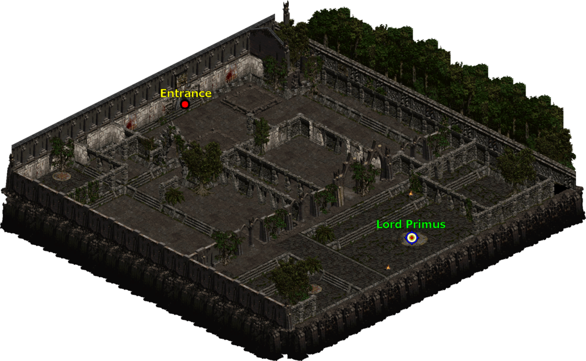
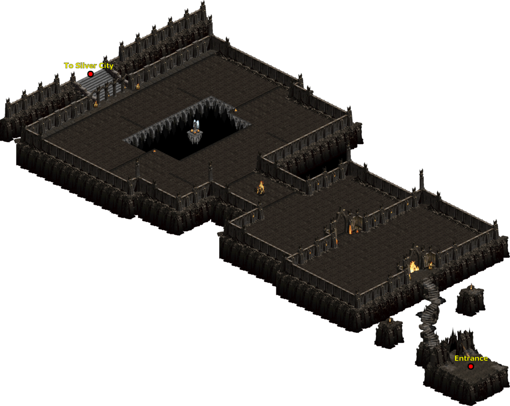
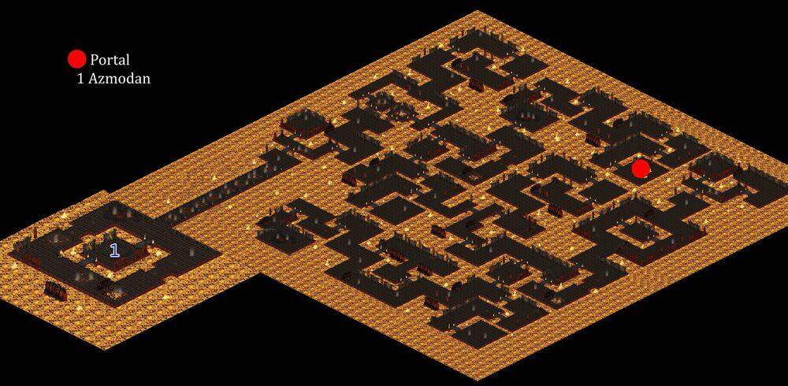

# 115 等超級任務

## 黑魔道

地獄難度 A1  
城鎮左下角馬車  
滑鼠稍微亂移一下  
出現文字就是了
王 Buyard Cholik 在綠色文字的位置

這邊固定時間會出現一大波的殭屍  
王只有在火圈裡面才能傷害到他  
他會放 PYROBLAST 火焰傷害法術  
全吃還蠻痛的  
傭兵會被他這招秒  
要注意

黑魔道  
留在物品欄有較多的額外好處  
需求等級: 115  
解鎖你的黑暗到技能  
最大技能等級提高 1  
+150 生命  
+150 法力

## 羅迪歐王子

地獄難度 A1  
牛關打死母牛王  
掉落維特的另外一條腿  
在牛關裡面放到盒子合成  
就會出現另外一個紅門

建議把紅門開在入口  
這樣撲街或是回補比較省時間

王會施放大範圍會擊退人的光  
這招很煩  
在這邊又不能使用傳送  
要多利用牛欄去閃他這招  
另外一招是會追人的小雞  
最後一招是大範圍全畫面的牛  
一般打他的策略是  
叫一堆小弟  
幫坦砲火  
然後狂打他  
小弟死光出紅門  
叫好叫滿，補血  
進來再打，重複

愚者金幣  
留在物品欄有較多的額外好處  
需求等級: 115  
+(0 to 38)力量  
+(0 to 38)敏捷  
+(0 to 38)體力  
+(0 to 38)能量  
總角色防禦+(11 to 15)%  
-10%金幣獲取率  
+(16 to 20)%打寶率

## 阿圖魯阿城

地獄難度 A2  
死亡之殿第三層  
小地圖上有個寶箱圖示  
打死那邊的小王就會出現紅門

進去之後地圖左手邊走到底有傳點  
打死弓手有一定機率會施放 arrowside  
就是一朵雲射一堆箭的  
防低、皮薄的很容易就被秒殺  
殺死三隻王  
拿到三顆石頭合成  
就會有諸神的太陽石

右上角有一個史卡塔拉島  
有 120 跟 125 的任務在裡面  
裡面也有傳點，記得踩  
可以省點時間

諸神的太陽石  
留在物品欄有較多的額外好處  
需求等級: 115  
+(3~5)%固定元素傷害  
提高最大生命 (11 to 15)%生命  
提高最大生命 (11 to 15)%法力

王有 4%機率掉落獎盃碎片  
3 個碎片可以合成獎杯  
獎盃跟護符合成可以增加  
5%物理抗性

另外王也有 16%機率會掉落阿斯卡利的呼喊  
那是招喚 120 雅馬王用的物品

## k3000

地獄難度 A3  
拖拉陽叢林左上角  
小王有 1/3 機率會掉落護符  
k3000 有比較高機率  
會掉落符文、珠寶、寶石、祭壇跟綠色套裝

塔安判官之錘  
留在物品欄有較多的額外好處  
需求等級: 115  
+25 精力因子至法術傷害  
+1 所有技能  
+1 額外圖騰  
增強武器傷害(每等級多 0.25)%

## 血魔甲

地獄難度 A3  
拖拉陽叢林右下角  
Chamber of Blood 的位置
這個任務有 20 秒鎖定  
王會招喚 blood golems  
blood golems 被殺死會在你腳下放火焰陷阱  
全吃其實還蠻痛的  
所以要一直走動
王本身是傷害免疫  
只有當他攻擊的時候才會破除免疫

血魔甲  
留在物品欄有較多的額外好處  
需求等級: 115  
+(3 to 5)%生命於擊中時偷取  
+(3 to 5)%法力於擊中時偷取  
最大技能等級提高 1

王有 6%機率掉落獎盃碎片  
3 個碎片可以合成獎杯  
獎盃跟護符合成可以增加  
總角色防禦+15%

## 拉斯瑪廣場

地獄難度 A3  
卡爾蒂姆左邊叫 Rathma Square 的地方

這邊的怪都是遠程的  
打死還會復活  
王會放 chronofield 降你物抗跟跑速  
也會放降抗詛咒  
另外一招是 bladestorm  
就是放出一堆刀的那招  
傷害蠻高的  
不過他血偏少

靈魂出竅的藥草  
留在物品欄有較多的額外好處  
需求等級: 115  
10%施法速度  
10%攻擊速度  
(21 to 150)%額外攻擊準確率加成  
(1 to 4)每秒生命回復

## 薩卡蘭姆的耳朵

地獄難度 A4  
打死 A4 的依卒爾會出現一個紅門  
進去之後會先到鑽石之門  
再往上走會到銀光之城  
他有傳點要記得踩  
在往上走會到命運文庫  
就是圖中 Library of Fate 的位置

在命運文庫有六隻天使  
就是圖中的 Zakarum's Avatar  
天使本身是傷害免疫的  
你要引小怪到他旁邊  
殺死小怪會有一個 debuff 波  
天使受到影響會有短暫的時間不是傷害免疫

這邊有會放 punisher 的無敵砲塔  
被毒到瞬間血量變成 1  
記得喝水解毒回血  
天使有 1/6 的機率會掉護符

### 鑽石之門

### 銀光之城

### 命運文庫

薩卡蘭姆的耳朵  
留在物品欄有較多的額外好處  
需求等級: 115  
+(6 to 10)% 所有屬性  
+(6 to 15)% 經驗值取得

## 虛榮神像

地獄難度 A4  
在上一張命運文庫的地圖  
右上角有一個 Cathedral of Vanity  
那邊有一個紅門  
進去就是王的位置了

裡面的怪都是傷害免疫的  
他中間有一個水晶球(crystal ball)  
你要先打爆他  
王才會出來  
怪才不會傷害免疫

虛榮神像  
留在物品欄有較多的額外好處  
需求等級: 115  
+15%作戰速度  
最大技能等級提高 1

有 6%機率會掉獎盃碎片  
獎盃跟護符合成會有以下屬性獎勵  
+20%招喚物生命  
+10%招喚物抗性

## 阿茲莫丹之心

地獄難度 A4  
打死混沌避難所右邊封印的王剛姆  
會掉落邪惡之鑰  
滑鼠右鍵點他  
會開啟另外一個紅門到罪惡之境  
阿茲莫丹在最左下角

那邊地上會有無敵隱形的怪
怪會變成火球  
很痛，記得閃  
王會放箭塔  
還有類似地雷的招式  
另外就是從天而降的 flamestrike  
不難，只是血有點多  
要花點時間  
還有隱形怪很煩

阿茲莫丹之心  
留在物品欄有較多的額外好處  
需求等級: 115  
最大元素抗性 +2%  
元素抗性 + (11 to 20)%  
-5%所有商人價格

有 6%機率會掉獎盃碎片  
獎盃跟護符合成會有以下屬性獎勵  
+150 生命  
+150 法力
