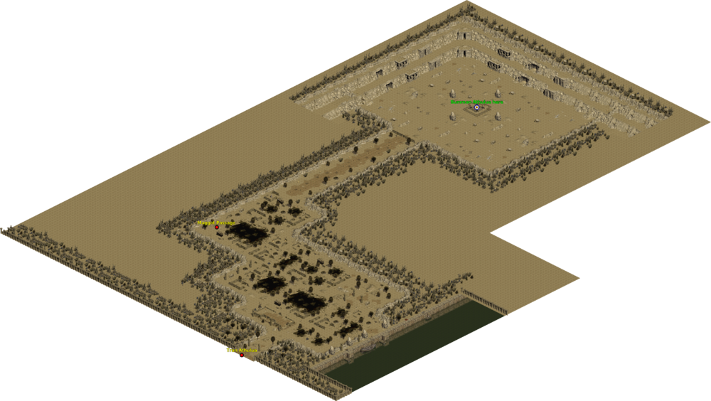
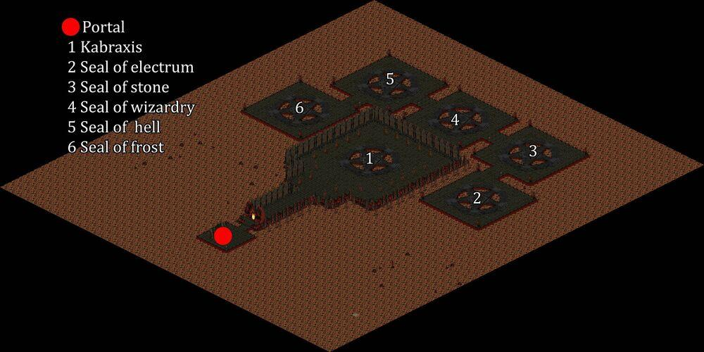
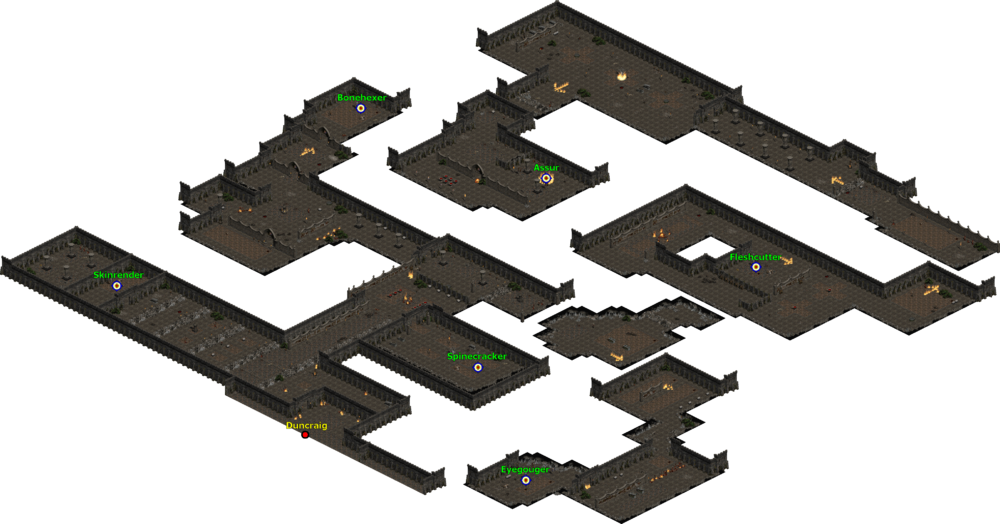

# 120 等超級任務

## 亞馬遜女神

地獄難度 A2  
阿圖魯阿城往上走會到史卡塔拉島  
右邊有傳點記得踩  
拿打阿圖魯阿城的小隻小王  
掉的阿斯卡利的呼喊卷軸  
去圖中間的祭壇  
滑鼠右鍵點擊阿斯卡利的呼喊卷軸  
就可以招換亞馬遜女神

假如防太低的話  
打這隻還蠻痛苦的  
不過王不會回血  
可以疊屍

### 阿圖魯阿城

### 史卡塔拉島

天氣控制  
留在物品欄有較多的額外好處  
需求等級: 120  
吉坦之門冷卻時間減少 1 秒  
(2~5)%固定元素傷害  
最大技能等級提高 1  
+10 所有屬性

有 20%機率會掉落 Deity's Bow  
Deity's Bow.跟六個不同的 emblems 合成會得到 Valkyrie's Prime

Valkyrie's Prime  
Sacred Bow  
Two-Hand Damage: (245 - 264) to (362 - 385)  
Required Level: 110  
Required Strength: 666  
Required Dexterity: 666  
Item Level: 105  
Dexterity Damage Bonus: (0.25 per Dexterity)%  
Strength Damage Bonus: (0.25 per Strength)%  
1% Chance to cast level 100 Athulua's Wrath when you Die  
15% Chance to cast level 35 Arrow on Striking  
+(1 to 4) to All Skills  
+(151 to 200)% Enhanced Damage  
Adds 150-250 damage  
Ignore Target's Defense  
+10 to Sky Siege  
Maximum Elemental Resists +(0 to 2)%  
Socketed (6)

## 地獄巴爾

地獄難度 A5  
有 20 分鐘的鎖定  
假如 TP 開在王座裡面  
過了 20 分鐘就不能進 TP 了  
不過還是可以從外面走進來

巴爾普攻有很大的機率會招喚  
恐龍以及 A1~A4 的王  
假如巴爾附近有小王  
巴爾是傷害免疫的  
你的小弟跟傭兵通常防都很低  
所以請先把你的小弟們先清空

巴爾會放冰凍衝擊波  
可以連續打很多下  
會放 HARBINGER  
傳到你身上打你  
還有燃燒法力  
一直讓你法力見底  
看到地上會先有黑色圈圈  
過一下下會擴散開來  
記得閃，全吃還蠻痛的

創造之魂  
留在物品欄有較多的額外好處  
需求等級: 120  
最大技能等級提高 1  
+25 力量  
最大法力 (1 to 5)%  
法力恢復速度 +10%  
元素抗性 +(1 to 10)%

也有一定機率會掉落搏動的世界之石碎片  
那是開啟 135 samuel 的任務物品

這隻王也有 6%機率會掉獎盃碎片  
跟護符合成會有以下屬性獎勵  
10%全抗

## 闊夫提信

地獄難度 A2  
卡爾蒂姆右上角  
會遇到一隻會變身的傭兵(Dumon)  
打死他會出現一個紅門  
進去就是了

這隻王會骨矛 nova  
四種元素的混和傷害以及 hive  
打這隻王的重點是  
你要撐到火冰電 81%抗性以上  
以及 150 左右的物理傷害減免

物理傷害減免比較麻煩  
tu 水晶劍 (50 物理傷害減免)  
tu Full Plate Mail  
Lo 符文組武器  
cham 符文組鞋  
等等都是比較容易入手的  
任意戒子洗 30 物理傷害減免  
項鍊會出最多 30  
可以再洗 30  
只要你達到以上條件  
打王基本已經不太掉血

### 卡爾蒂姆

烏雷的銀封印  
留在物品欄有較多的額外好處  
需求等級: 120  
+(21 to 30) 法術精力因子  
+1 所有技能  
(21 to 25)% 招喚物傷害  
(11 to 15)% 招喚物抗性  
+(11 to 20) 力量  
+(11 to 20) 敏捷  
+(11 to 20) 體力  
+(11 to 20) 能量

這隻王也有 6%機率會掉獎盃碎片  
跟護符合成會有以下屬性獎勵  
+8% 法術傷害

## 審判日

地獄難度 A4
在銀光之城右上角  
有一個銀光尖塔紅門 (silver spire)  
經過銀光尖塔一層跟二層最後會到水晶聖拱  
往上走會遇到一個穿長袍的人  
不久會出現兩個紅門  
那兩個紅門裡面各有一隻王  
打死任意一隻王會有護符  
每個紅門都有 20 秒的鎖定

不過這個任務有一個額外獎勵就是  
當你打死其中一隻王的時候  
身上會有一個持續一分鐘的光環  
當你身上有兩個光環的時候  
把護符放到盒子裡面合成  
就會有額外獎勵  
也就是打死兩隻王間隔不能超過一分鐘  
而且不能死，死了光環就不見

建議先打右邊的王  
因為地形比較差

### 銀光之城

### 銀光之城

水晶烈焰勳章  
留在物品欄有較多的額外好處  
需求等級: 120  
+1 招喚艾迪倫  
火焰吸收 5%  
冰冷吸收 5%  
閃電吸收 5%

一分鐘內合成給的額外獎勵是  
+1 所有技能  
+40 所有屬性

王也有 4%機率會掉獎盃  
跟護符合成會有以下屬性獎勵  
+5% 所有屬性

## 卡拔克西斯、希望小偷

地獄難度 A4
在 A1 左下角的馬車  
然後打死左上角 115 的 Cholik  
進去那個紅門  
打爆中間的塔  
王就會出來了

這隻王的招式  
會放 punisher nova  
被毒到可以喝水解  
會放毒傷版的 flamestrike  
很痛，看到地上有綠綠的記得跑  
不然吃到通常就是 esc  
會放 balefire  
全吃也是超痛  
你離他太遠他會 pounce 到你身上  
然後擊退你，並叫出一堆小兵  
另外一招是 ROTTING FLESH  
就是身旁會有一坨東西圍著 他
傷害不高，不要被他嚇到

打他的基本策略是  
離他適當的距離  
他就會一直放 balefire  
找 balefire 的空檔攻擊他  
身上最好有緩速的裝備或是技能  
這樣 balefire 會好閃很多  
假如你被他殺死  
王會補血，所以也不能疊屍過

卡拔克西斯之魂  
留在物品欄有較多的額外好處  
需求等級: 120  
+1 所有技能  
+(1 to 3)% 最大火焰抗性  
+(1 to 3)% 最大冰冷抗性  
+(1 to 3)% 最大閃電抗性  
+(1 to 3)% 最大毒素抗性

王也有 6%機率會掉獎盃碎片  
跟護符合成會有以下屬性獎勵  
+2% 復活怪 (可能為精英)

王後面的 2~6 的位置  
都有一個不同元素屬性的小王  
你要先把小王附近的小兵清光  
才能傷害到小王  
殺死每個小王都會有一顆寶石  
收集五顆的不同寶石然後跟黑暗道的護符合成  
黑暗道護符就會多一個開啟限時秘境的功能

### 黑魔道

### 卡拔克西斯

## 影子王國

地獄難度 A3
在打闊夫提信那個房間的右下角  
會有一個紅門  
進去之後假如你的位置在地圖左下角  
那任務的位置就在右下角差不多對應的位置  
假如一進去是在地圖右下角  
那任務的位置就在左上角  
任務的位置外型像一個低矮的房子

進去之後會遇到很多跑很快的殭屍  
殭屍都是無敵的  
而且攻擊會放 bloodstorm  
王就是地圖 2 的位置

影子王國

永恆骨堆  
留在物品欄有較多的額外好處  
需求等級 l: 120  
+(1 to 2) 亞馬技能  
+(1 to 2) 刺客技能  
+(1 to 2) 野人技能  
+(1 to 2) 德魯技能  
+(1 to 2) 死靈技能  
+(1 to 2) 聖騎技能  
+(1 to 2) 法師技能  
+10% 移動速度

王也有 6%機率會掉獎盃碎片  
跟護符合成會有以下屬性獎勵  
+10% 移動速度

## 特剛澤

地獄難度 A3
拖拉陽叢林往右走到底有個地窖  
進去會到拖拉陽墓地  
再往右走到底就會看到特剛澤的入口的

這裡面都是元素攻擊的小法師  
這邊會掉元素符文  
王在地圖正中間

王變蝙蝠的時候是無敵  
不要站在同一個地方太久  
風箏著打他  
本身不要太軟的話  
不難

### 特剛澤

安巴魯寶物
留在物品欄有較多的額外好處
需求等級: 120
(6 ~ 10)%法術傷害
精華位置: 20

安巴魯寶物可以跟原始符文石或是精華合成
會給與(-3 to +5) 屬性
總共可以合成 20 次

## 三聖會

地獄難度 A3
卡爾蒂姆往左邊的拉斯瑪廣場  
把王打死出現的紅門  
進去就是了

先到地圖中間的小房間  
打死小王拿到 tome of possession  
放在物品欗會多一個魅惑的技能  
然後往右走，經過一個長長的通道  
會遇到一隻射出東西的王，Malic  
Malic 是無敵，打不死  
也不是我們的目標  
繼續往右邊會看到 Lucion  
把他引出來，然後魅惑他  
讓 Lucion 跟 Malic 打架  
只有 Malic 才能傷害 Lucion  
當 Lucion 血少於一半的時候  
他會狂暴  
移動速度會變得很快  
蝙蝠會放技能讓人順移到其他地方  
打這隻就是要有點耐心跟運氣  
抓好 timing  
Lucion 清醒的瞬間會有短暫的僵直  
趕快魅惑他  
躲好 Malic 射出來的東西  
久了就過了  
算中等難度

### 三聖會

腐化蟲洞  
留在物品欄有較多的額外好處  
需求等級 l: 120

地圖裡面的怪有一定機率會掉落圓環(cycle)  
可以跟腐化蟲洞做合成

王也有 6%機率會掉獎盃碎片  
跟護符合成會有以下屬性獎勵  
+30% 打寶率

## 敦克雷格

地獄難度 A1
左下角馬車進去黑魔道任務  
然後右上角的洞穴進去  
走到底到另外一個入口  
進去就是敦克雷格了  
左邊有傳點，記得踩

地圖上五個有封印標誌的地方都有小王  
打死各有五個不同的戒子  
裡面的怪也會隨機掉落一個任務戒子  
把六個戒子放到盒子合成  
就可以拿到亞述爾之災  
戴上這個戒子會多一個淨化的功能

這任務的王是傷害免疫的  
只能用淨化去打他  
打死王會掉落惡魔之災

### 黑魔道

### 敦克雷格

惡魔之災  
留在物品欄有較多的額外好處  
需求等級: 120  
+(0 to 2) 亞馬技能  
+(0 to 2) 刺客技能  
+(0 to 2) 野人技能  
+(0 to 2) 德魯技能  
+(0 to 2) 死靈技能  
+(0 to 2) 聖騎技能  
+(0 to 2) 法師技能  
+5 每秒生命回復

有 6%機率會掉獎盃碎片
跟護符合成會有以下屬性獎勵
+10% 作戰速度
