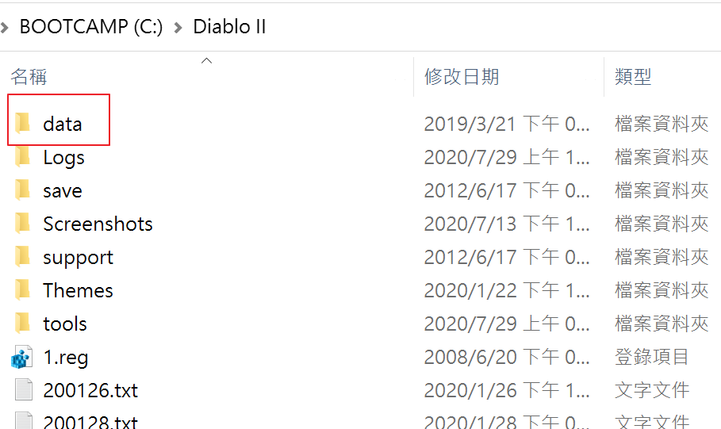
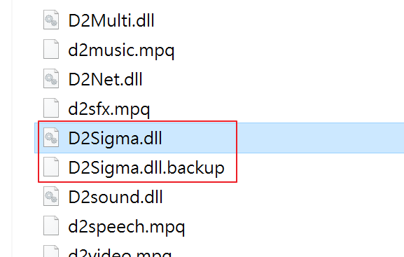
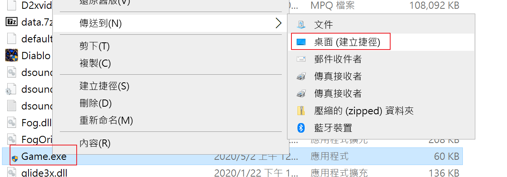
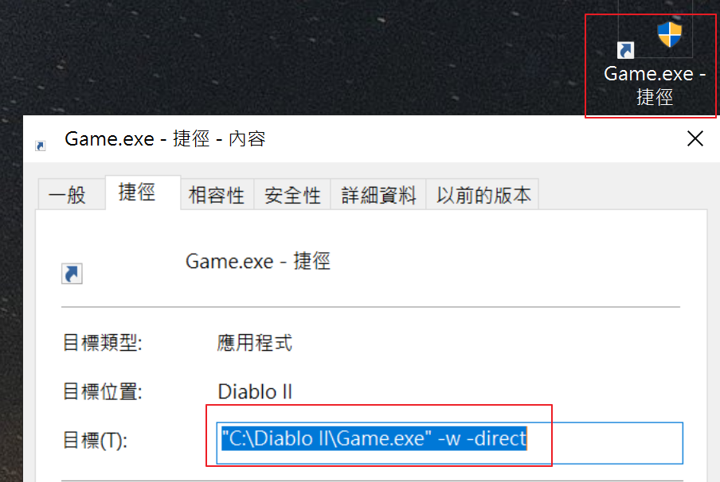

# 單機掉寶模式

## 安裝方式

(已知 bug: 技能圖示顯示不正常)

- 下載 [data](https://drive.google.com/file/d/1bcQytb1F60APOAjxd9KJNAHGtq-1ig2a/view?usp=sharing)
- 解壓縮後放到 d2(魔電)安裝的資料夾
- 備份 D2Sigma.dll  
  改名為 D2Sigma.dllbackup
- 下載掉寶模式的 [D2Sigma.dll](https://drive.google.com/file/d/1455o-Et_01GoeLtZTLisZVO6aHPpDTfi/view?usp=sharing)  
  放到魔電資料夾
- 在魔電資料夾找一個叫 game.exe 的檔案  
  按滑鼠右鍵 > 點選 傳送到桌面當捷徑
- 在桌面找到 game.exe 的捷徑  
  按滑鼠右鍵 > 點選內容  
  在目標的最後面加上 -w -direct
- 用桌面的 game.exe 開遊戲就是打寶模式

### 把 data.zip 解壓縮，放到魔電目錄

### 備份 D2Sigma.dll，把調寶模式的 D2Sigma.dll 複製到魔電資料夾

### game.exe 傳送到桌面當捷徑

### 在目標的最後面加上 -w -direct

## 移除方式

- 移除 D2Sigma.dll
- 把備份的 D2Sigma.dllbackup 改名成 D2Sigma.dll
- 用魔電啟動器開遊戲就可以正常玩了

PS: 連戰網要記得改回來，不然有可能會被當成外掛
