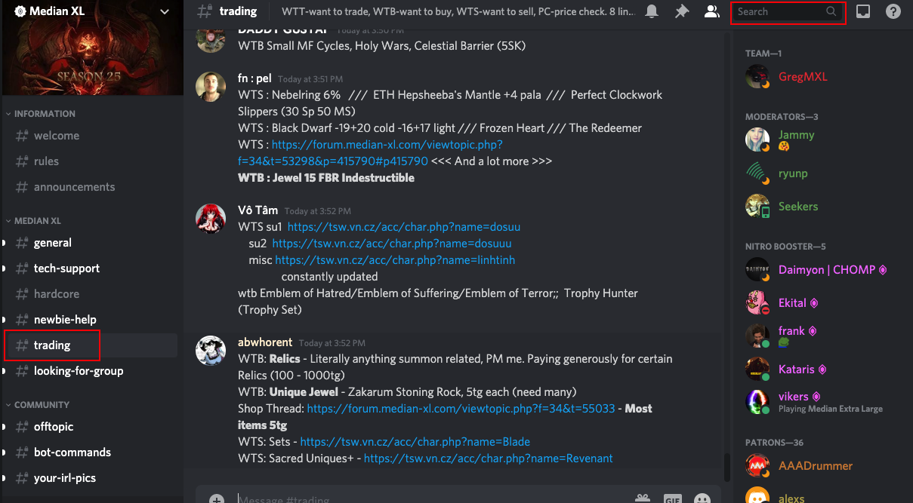
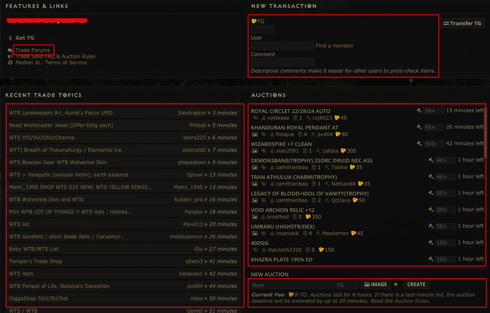

# 交易

## 官方 discord 交易頻道

### 反應比較即時

到[官方網站](http://median-xl.com)  
點擊 community > Discord Chat  
就能加入魔電官方的 discord  

點一下紅門認證

左邊的 trade，就是交易頻道  
中間是叫賣的內容  
右上角可以搜尋  
常見術語:  
WTB: 想要買  
WTS: 想要賣  
WTT: 想要交易(以物易物)  
交易規定: 每 20 分鐘只能貼一次，最多八行，每行 3 個物品，每次最多一個圖片

## 官方論壇交易

到[官方論壇](https://forum.median-xl.com/index.php)註冊帳號  
點一下 trade center(交易中心)  

交易中心分兩個功能:  
一個是拍賣(Auctions)  
一個是交易文章(trade topics)  
按左上角的 Trade Forums 就可以到交易文章區  
Recent Trade Topic 是最近的交易文章  
右邊的 Auctions 就是正在拍賣的東西  
上面的 New Transaction 就是轉 TG(trade gold，交易貨幣)  
comment(備註)可以隨便寫  
資料填完，按下 transfer TG 就會轉 tg 了

下面那個 new Auction 就是建立拍賣  
item 填拍賣標題  
tg 是起標價  
image 是物品的截圖(可有可無)  
旁邊的+是用人物交易  
點下去之後，就會有人物可以選(要稍微等它讀取才會看到)  
把你要賣的東西放到該人物  
結標之後，該人物會自動轉給得標的人  
注意要用新創等級一的人物去轉  
不然等級越高收的手續費越多  
然後按下 create 就可以建立拍賣了  
剛建立短時間內可以取消拍賣

## 查詢物價

一樣在交易中心的頁面  
拉下來一點會看到 Search/Price check  
在紅色框框裡面就可以打關鍵字搜尋  
下面的表單就是歷史成交價格  

